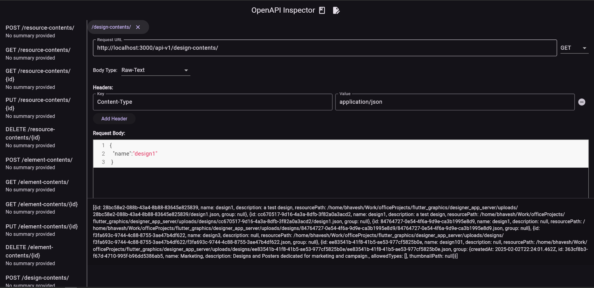
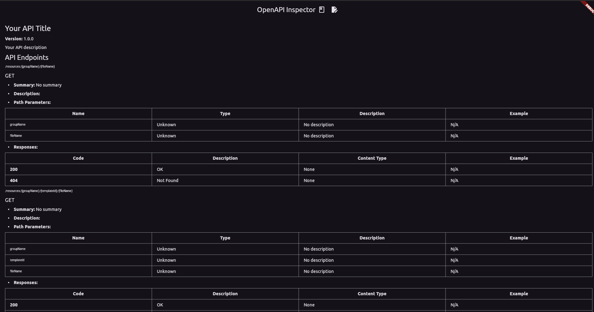

# openapi_ui

An Alternative to swaggerUI  OpenAPI-UI has both documentation page plus intractive page just like postman which makes it overall better view for developers who have familarity with postman.

## Screenshots

# OpenAPI-UI
